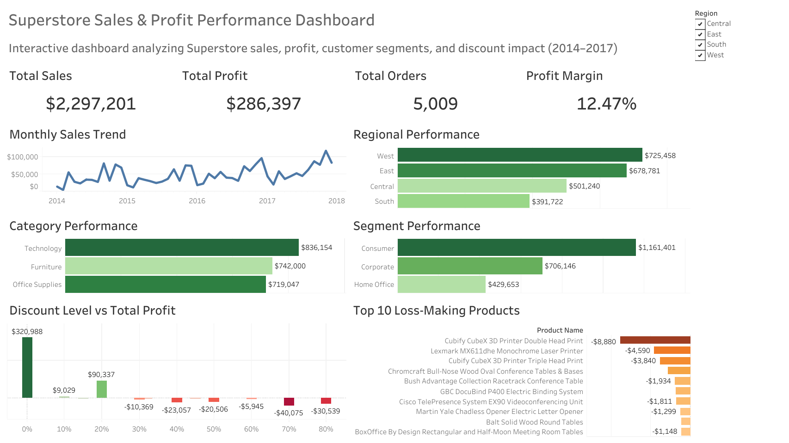

# 📊 Superstore Sales & Profit Analysis Dashboard

## 📌 Project Overview

This project analyzes the Sample Superstore dataset to uncover insights into sales, profit, customer segments, product categories, regional performance, discount impact, and loss-making products.

The project was created as part of my Data Analytics portfolio after completing the Google Data Analytics Professional Certificate.

---

## 🎯 Business Objective

Help business stakeholders understand:

- Overall business performance
- Sales and profit trends
- Best performing regions
- Category and segment performance
- Impact of discounts on profitability
- Products generating the highest losses

---

## 🛠 Tools Used

- Tableau Public
- Microsoft Excel
- SQL (PostgreSQL)
- GitHub

---

## 📂 Dataset

Sample Superstore Dataset

Contains:

- Orders
- Customers
- Products
- Categories
- Sales
- Profit
- Discount
- Regions

---

# 📈 Dashboard

The dashboard contains:

### KPI Cards

- 💰 Total Sales
- 💵 Total Profit
- 📦 Total Orders
- 📊 Profit Margin

---

### Visualizations

✔ Monthly Sales Trend

✔ Regional Performance

✔ Category Performance

✔ Segment Performance

✔ Discount Level vs Total Profit

✔ Top 10 Loss-Making Products

---

## 📊 Key Insights

### 1. Technology generated the highest sales

Technology contributed the largest share of revenue among all product categories.

---

### 2. West region performed the best

The West region recorded the highest sales.

---

### 3. Consumer segment generated maximum sales

Consumer customers contributed the largest portion of total sales.

---

### 4. Higher discounts reduce profitability

Discounts above 30% frequently resulted in negative profits.

---

### 5. Several products consistently generate losses

The dashboard highlights the Top 10 products with the largest losses, helping identify products that require pricing or inventory review.

---

## 📸 Dashboard Preview


---

## 🔗 Tableau Dashboard

👉 View the interactive dashboard here:

https://public.tableau.com/app/profile/disha.rana4981/viz/SuperstoreSalesDashboard_17860111038710/Dashboard1

## 📁 Repository Structure

```
Superstore-Analysis/
│
├── Dashboard/
│   └── Superstore Dashboard.twb
│   └── Superstore Dashboard.twbx
│
├── Images/
│   └── dashboard.png
│
├── Dataset/
│   └── SampleSuperstore.csv
│
├── SQL/
│   └── analysis_queries.sql
│
└── README.md
```

---

## 📚 Skills Demonstrated

- Data Cleaning
- SQL Analysis
- Business Analysis
- Dashboard Design
- Data Visualization
- KPI Reporting
- Storytelling with Data
- Tableau Public
- GitHub Documentation

---

## 👩 About Me

I'm an aspiring Data Analyst with a strong interest in business intelligence, data visualization, and SQL.

Recently completed the **Google Data Analytics Professional Certificate** and currently building real-world portfolio projects.

📧 Email: dishar37@gmail.com

🔗 LinkedIn:

🔗 Tableau Public: *(Your Tableau Profile)*
